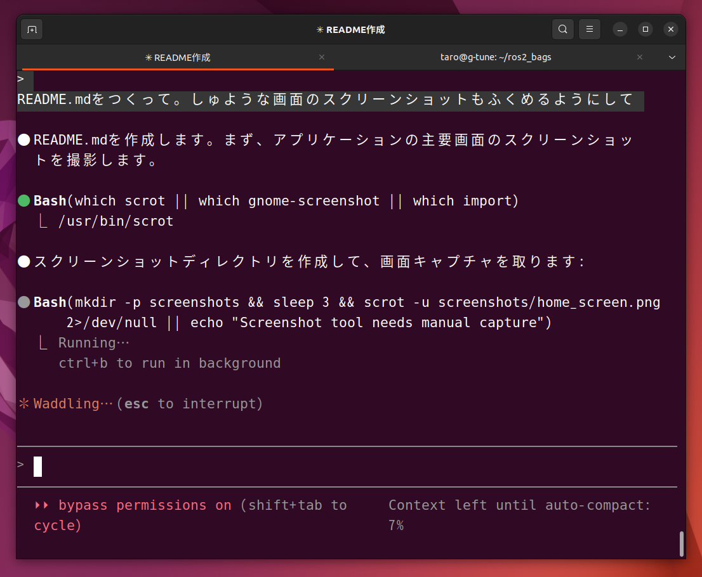
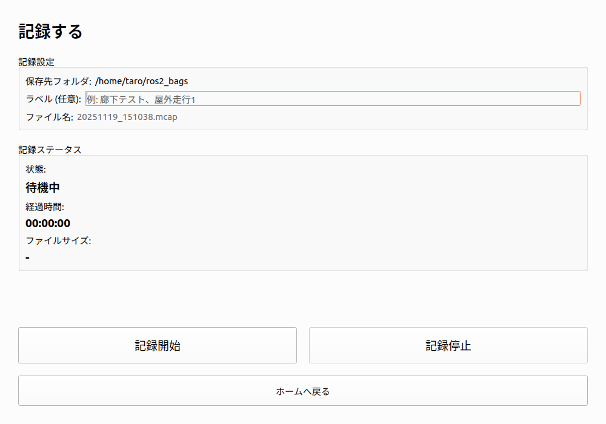
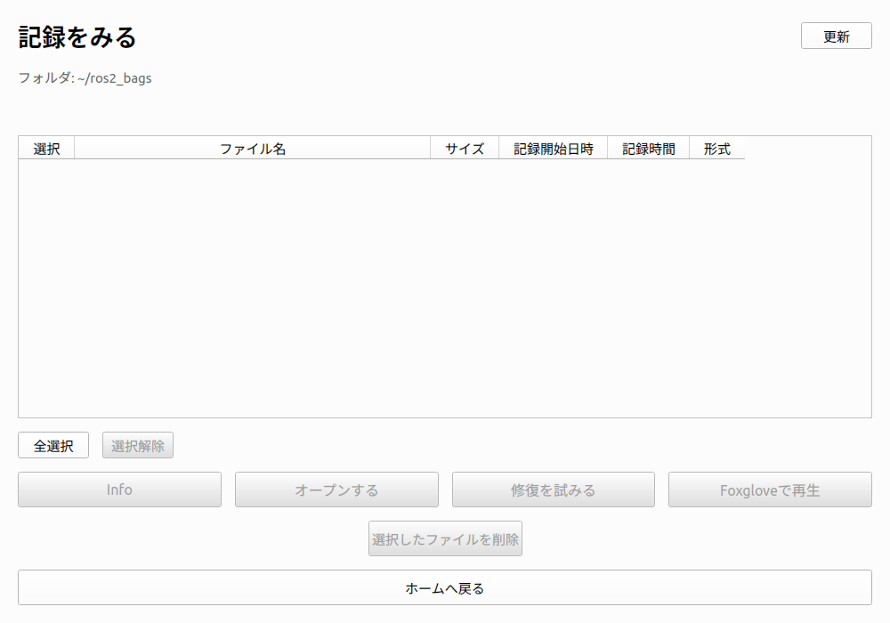
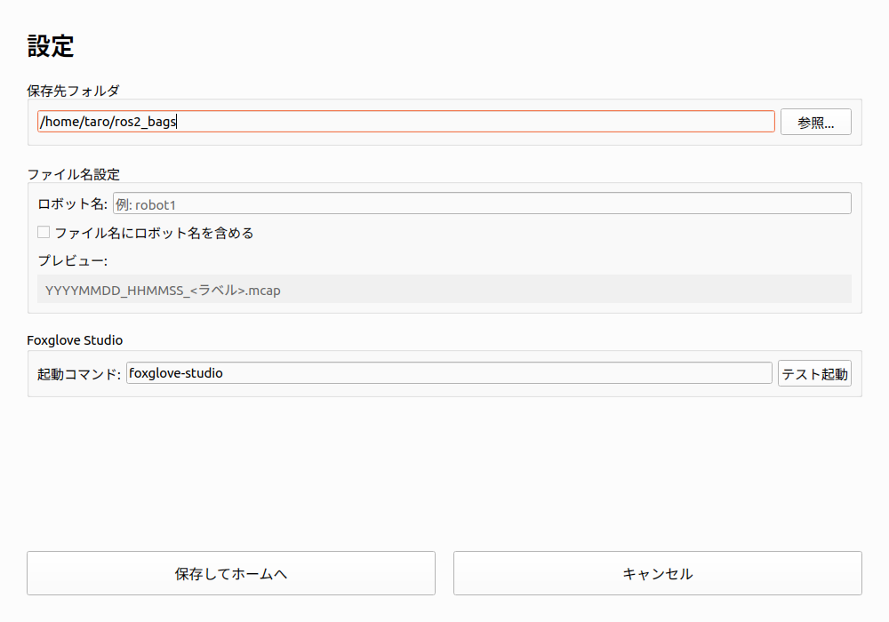

# Susumu Bag Cabinet

ROS2 Bagファイル管理アプリケーション - タッチパネル対応のGUIツール


## 概要

Susumu Bag Cabinetは、ROS2のbagファイル（MCAP/DB3形式）を簡単に記録・管理・閲覧できるGUIアプリケーションです。タッチパネル操作を想定した大きなボタンと直感的なインターフェースを提供します。

### 主な特徴

- 🎯 **タッチパネル対応** - 大きな正方形ボタンで簡単操作
- 📦 **簡単記録** - ワンクリックでbag記録開始・停止
- 📊 **自動メタデータ取得** - ファイル情報をバックグラウンドで自動取得
- 🗜️ **Zstd圧縮** - 約58%のサイズ削減が可能
- 🔧 **修復機能** - 破損したbagファイルの修復
- 🗑️ **安全な削除** - 確認ダイアログ付き削除機能
- 📈 **プログレス表示** - 長時間処理の進捗を可視化

## スクリーンショット

### ホーム画面


3つの大きな正方形ボタンで主要機能にアクセス。

### 記録画面


- カスタムラベル設定
- リアルタイムの経過時間表示
- ファイルサイズのモニタリング
- 自動ファイル名生成

### 閲覧画面


- ファイル一覧表示（サイズ、日時、形式、圧縮状態）
- チェックボックスで複数選択
- 圧縮・修復・削除・Foxglove再生

### 設定画面


- 保存先フォルダ設定
- ロボット名設定
- ファイル名プレビュー

## 必要要件

### システム要件
- Python 3.8以上
- ROS2 (Humble / Iron / Jazzy)
- Linux (Ubuntu 22.04推奨)

### 必須パッケージ
- PySide6 >= 6.5.0
- PyYAML >= 6.0
- ros2 bag コマンド

### オプション
- Foxglove Studio (bag再生機能を使う場合)

## インストール

### 1. リポジトリのクローン

```bash
git clone https://github.com/yourusername/susumu_bag_cabinet.git
cd susumu_bag_cabinet
```

### 2. 依存パッケージのインストール

```bash
# Python依存関係
pip install -r requirements.txt

# または開発モードでインストール
pip install -e .
```

### 3. ROS2環境のセットアップ

```bash
source /opt/ros/humble/setup.bash  # または iron, jazzy
```

## 実行方法

### 方法1: 直接実行

```bash
python -m susumu_bag_cabinet.main
```

### 方法2: シェルスクリプト

```bash
./run.sh
```

### 方法3: インストール後のコマンド

```bash
susumu-bag-cabinet
```

## 使い方

### 初回起動

1. アプリケーションを起動
2. 「⚙ 設定をひらく」をクリック
3. 保存先フォルダを設定（デフォルト: `~/ros2_bags`）
4. 必要に応じてロボット名を設定

### Bagファイルの記録

1. **「🟥 記録する」** をクリック
2. 任意でラベルを入力（例: "廊下テスト", "屋外走行1"）
3. **「記録開始」** をクリック
4. 記録中は経過時間とファイルサイズがリアルタイムで表示
5. **「記録停止」** で記録終了

**ファイル名形式:**
```
YYYYMMDD_HHMMSS_<ラベル>.mcap
例: 20251119_143025_廊下テスト.mcap
```

### Bagファイルの閲覧・管理

1. **「🟦 記録をみる」** をクリック
2. ファイル一覧が表示される
3. チェックボックスでファイルを選択

**利用可能な操作:**

| 操作 | 説明 |
|------|------|
| 圧縮する | Zstd形式で圧縮（元ファイルは`_uncompressed`として保持） |
| 整合性チェック | ファイルの破損をチェック |
| 修復を試みる | NGと表示されたファイルを修復 |
| Foxgloveで再生 | Foxglove Studioで開く（1ファイルのみ） |
| 選択したファイルを削除 | 選択ファイルを削除（元に戻せません） |

### 圧縮機能の使用

1. 未圧縮のファイルを選択
2. **「圧縮する」** をクリック
3. 確認ダイアログで **「Yes」**
4. プログレスダイアログで進捗確認
5. 完了後、元ファイルは`_uncompressed`に、圧縮版が元の名前に

**圧縮効果:**
- 2.0 GB → 839 MB（約58%削減）
- 形式: Zstd圧縮

### 削除機能の使用

⚠️ **注意: この操作は元に戻せません！**

1. 削除したいファイルを選択
2. 赤い **「選択したファイルを削除」** ボタンをクリック
3. 警告ダイアログで削除対象を確認
4. **「Yes」** で削除実行
5. プログレスダイアログで進捗確認

## プロジェクト構成

```
susumu_bag_cabinet/
├── susumu_bag_cabinet/
│   ├── __init__.py
│   ├── main.py              # エントリーポイント
│   ├── ui/                  # UIコンポーネント
│   │   ├── main_window.py   # メインウィンドウ（QStackedWidget）
│   │   ├── home_page.py     # ホーム画面
│   │   ├── record_page.py   # 記録画面
│   │   ├── browse_page.py   # 閲覧画面
│   │   └── settings_page.py # 設定画面
│   ├── workers/             # バックグラウンド処理
│   │   └── bag_scanner.py   # ファイルスキャナー（QThread）
│   └── utils/               # ユーティリティ
│       ├── config.py        # 設定管理（JSON）
│       ├── bag_utils.py     # Bag操作ユーティリティ
│       └── bag_operations.py # 圧縮・修復機能
├── screenshots/             # スクリーンショット
├── requirements.txt
├── setup.py
├── run.sh                   # 起動スクリプト
├── LICENSE
└── README.md
```

## 設定ファイル

設定は以下の場所に保存されます:

```
~/.config/susumu_bag_cabinet/config.json
```

**設定内容:**
```json
{
  "bag_folder": "/home/user/ros2_bags",
  "robot_name": "robot1",
  "foxglove_command": "foxglove-studio",
  "filename_include_robot_name": false
}
```

## トラブルシューティング

### ros2コマンドが見つからない

ROS2環境が正しくセットアップされているか確認:

```bash
source /opt/ros/humble/setup.bash
ros2 bag --help
```

### Foxglove Studioが起動しない

1. Foxglove Studioがインストールされているか確認:
```bash
which foxglove-studio
```

2. 設定画面で正しいコマンドを設定

### bagファイルが検出されない

- `metadata.yaml`が存在するか確認:
```bash
ls ~/ros2_bags/*/metadata.yaml
```

- 未圧縮bagの場合、metadata.yamlがないことがあります
- アプリは`.mcap`ファイルや`.db3`ファイルも検出します

### 圧縮が失敗する

- Zstdプラグインがインストールされているか確認:
```bash
ros2 bag info --help | grep compression
```

### 大量のファイルでスキャンが遅い

- バックグラウンドで処理されるため、UIは応答します
- プログレスバーで進捗を確認できます

## テスト

### 自動テスト

```bash
# 基本コンポーネントテスト
python test_basic.py

# 閲覧機能テスト
python test_browse.py

# GUIテスト
python test_gui.py
```

### 手動テスト

詳細なテストシナリオは[TESTING.md](TESTING.md)を参照してください。

## 開発

### 開発モードでのインストール

```bash
pip install -e .
```

### コードスタイル

- PEP 8準拠
- 型ヒントの使用
- Docstringの記述

### 貢献

プルリクエストを歓迎します！

1. このリポジトリをフォーク
2. フィーチャーブランチを作成 (`git checkout -b feature/amazing-feature`)
3. 変更をコミット (`git commit -m 'Add amazing feature'`)
4. ブランチにプッシュ (`git push origin feature/amazing-feature`)
5. プルリクエストを作成

## 既知の制限事項

1. **圧縮形式**: Zstdのみ対応（LZ4プラグインが必要）
2. **DB3修復**: SQLite3形式の自動修復は未実装
3. **並列処理**: 圧縮・修復は順次処理（将来的に並列化予定）
4. **ファイルサイズ**: 非常に大きなファイル（>10GB）では処理に時間がかかる場合があります

## 今後の拡張予定

- [ ] トピック選択記録
- [ ] 複数ファイルの結合
- [ ] LZ4圧縮対応
- [ ] DB3形式の修復機能
- [ ] カスタムテーマ対応
- [ ] 統計情報の表示
- [ ] エクスポート機能

## ライセンス

MIT License - 詳細は[LICENSE](LICENSE)ファイルを参照してください。

## 作者

Susumu Bag Cabinet Development Team

## 謝辞

- ROS2コミュニティ
- PySide6開発チーム
- Foxglove Studio

## サポート

- Issues: [GitHub Issues](https://github.com/yourusername/susumu_bag_cabinet/issues)
- Discussions: [GitHub Discussions](https://github.com/yourusername/susumu_bag_cabinet/discussions)

---

**注意**: このアプリケーションは実験的なものです。本番環境での使用前に十分なテストを行ってください。
